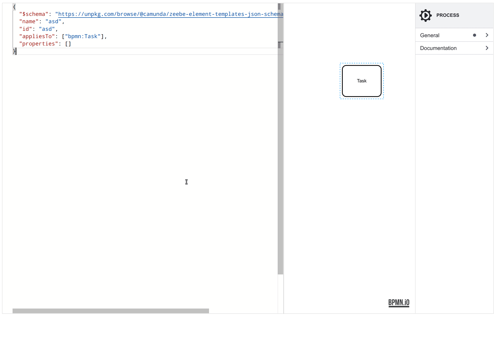

# element-template-playground

A simple playground to define + preview Camunda 8 element templates. [:arrow_right: __Try it out__](https://bpmn-io.github.io/element-template-playground).

[](https://bpmn-io.github.io/element-template-playground)


## Build

```sh
npm install
```

```sh
# build into ./public
npm run build

# run locally
npm start
```
